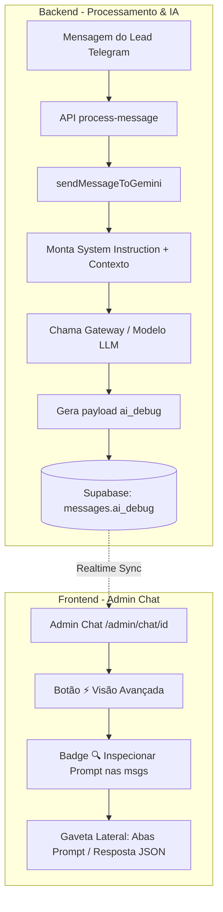

# Visão Avançada: Inspetor de Prompt e Resposta da IA - Implementation Plan

> **For agentic workers:** REQUIRED SUB-SKILL: Use superpowers:subagent-driven-development to implement this plan task-by-task. Steps use checkbox (`- [ ]`) syntax for tracking.

**Goal:** Implementar no painel administrativo de chat com lead (`/admin/chat/[id]`) o modo de **Visão Avançada** (`⚡ Visão Avançada`), que permite ao administrador inspecionar o prompt completo enviado para a IA e o JSON bruto completo retornado por ela para cada resposta gerada.

**Architecture:** A geração de resposta em `sendMessageToGemini` e `process-message/route.ts` montará e persistirá um objeto estruturado `ai_debug` (com system prompt, user prompt, clean history, modelo, tempo e JSON bruto) na coluna `messages.ai_debug`. Na interface `/admin/chat/[id]`, o toggle de Visão Avançada adiciona badges `[ 🔍 Inspecionar Prompt ]` que abrem uma gaveta lateral (Drawer) com abas separadas para Prompt Enviado, Resposta Bruta (JSON) e cópia rápida com 1 clique.

**Architecture Diagram:**

**Tech Stack:** Next.js 16 (App Router), React 19, TypeScript, Tailwind CSS, Supabase (PostgreSQL + Realtime).

## Global Constraints

- Never break active lead conversation flow even if database schema lacks `ai_debug` or payload serialization fails (resilient try/catch & fallback).
- Keep UI consistent with existing dark theme `#080b10` / `#0b0f16` and cyan/amber/emerald accents.
- Full TypeScript strict typing without `any` regressions where possible.
- Support real-time updates when new messages arrive.

---

### Task 1: Database Migration & TypeScript Types for AI Debug

**Files:**
- Create: `ai_debug_migration.sql`
- Modify: `src/types.ts`
- Modify: `supabase_schema.sql`

**Interfaces:**
- `AiDebugData` interface with `timestamp`, `model`, `provider`, `tier`, `duration_ms`, `system_prompt`, `user_prompt`, `clean_history`, `raw_response`, `stages`.
- Extends `Message` interface to optionally include `ai_debug?: AiDebugData | null`.

- [ ] **Step 1: Define `AiDebugData` in `src/types.ts`**
- [ ] **Step 2: Create SQL migration `ai_debug_migration.sql` with `ALTER TABLE messages ADD COLUMN IF NOT EXISTS ai_debug JSONB;`**
- [ ] **Step 3: Update `supabase_schema.sql` to include `ai_debug JSONB` in table definition**
- [ ] **Step 4: Verify type exports and compile check**

---

### Task 2: Capture and Persist AI Debug Data in AI Engine & Message Processing

**Files:**
- Modify: `src/lib/gemini.ts`
- Modify: `src/app/api/process-message/route.ts`

**Interfaces:**
- `sendMessageToGemini` returns `AIResponse & { ai_debug?: AiDebugData }`
- `process-message/route.ts` inserts `ai_debug` in the `thought` (or `bot`) message record in Supabase with safe fallback.

- [ ] **Step 1: In `src/lib/gemini.ts`, accumulate `ai_debug` payload during `sendMessageToGemini` execution**
- [ ] **Step 2: Attach `system_prompt` (complete `baseInstruction` + dynamic blocks + catalog), `user_prompt`, `clean_history`, `raw_response`, model info and execution time to `aiResponse.ai_debug`**
- [ ] **Step 3: In `src/app/api/process-message/route.ts`, persist `ai_debug` when inserting the thought/bot message into `messages` table**
- [ ] **Step 4: Add fallback catch so that if `ai_debug` column is missing or serialization fails, standard message insert proceeds**

---

### Task 3: Create Prompt Inspector Drawer Component for Admin Chat

**Files:**
- Create: `src/app/admin/chat/[id]/components/PromptInspectorDrawer.tsx`

**Interfaces:**
- Props: `open: boolean`, `onClose: () => void`, `debugData: AiDebugData | null`, `messageCreatedAt?: string`
- Features:
  - Tab 1: **📤 Prompt Enviado** (System Prompt + User Prompt + History) with Copy button.
  - Tab 2: **📥 Resposta Bruta (JSON)** (formatted JSON with syntax styling and Copy button).
  - Tab 3: **🧠 Etapas do Pipeline** (breakdown of Strategy, Draft, Review if present).
  - Metadata header: Model, Provider, Duration (ms), Tier, Created at.
  - Empty state when message has no debug data (for older messages).

- [ ] **Step 1: Create `PromptInspectorDrawer.tsx` with clean dark theme UI and responsive drawer layout**
- [ ] **Step 2: Implement multi-tab navigation (Prompt Enviado, Resposta JSON, Detalhes)**
- [ ] **Step 3: Implement 1-click clipboard copy with feedback toast/state for both prompt and JSON**
- [ ] **Step 4: Add support for formatted JSON viewer with collapsible/scrollable blocks**

---

### Task 4: Integrate Advanced View Toggle and Inspector into Admin Chat Page

**Files:**
- Modify: `src/app/admin/chat/[id]/page.tsx`

**Interfaces:**
- Add `showAdvancedView` state (persisted in localStorage or session state).
- Add header toggle button `⚡ Visão Avançada`.
- Add `[ 🔍 Inspecionar Prompt ]` button in message bubbles / thought bubbles when `showAdvancedView` is active (or when debug data exists).
- Wire drawer open/close to active selected message debug data.

- [ ] **Step 1: Add `showAdvancedView` toggle and `selectedDebugMessage` state in `AdminChatPage`**
- [ ] **Step 2: Add `SegmentButton` for `⚡ Visão Avançada` in the header bar**
- [ ] **Step 3: Update `MessageBubble` to render `[ 🔍 Inspecionar Prompt ]` badge when `message.ai_debug` exists or when advanced view is active**
- [ ] **Step 4: Connect clicking badge to open `PromptInspectorDrawer` with the message's debug data**
- [ ] **Step 5: Verify realtime subscription updates message list including `ai_debug`**

---

### Task 5: End-to-End Build and Verification

**Files:**
- Verify all modified files

- [ ] **Step 1: Run `npm run build` to verify Next.js TypeScript and React 19 compilation**
- [ ] **Step 2: Verify lint and build output clean of errors**
- [ ] **Step 3: Document walkthrough and usage instructions**
